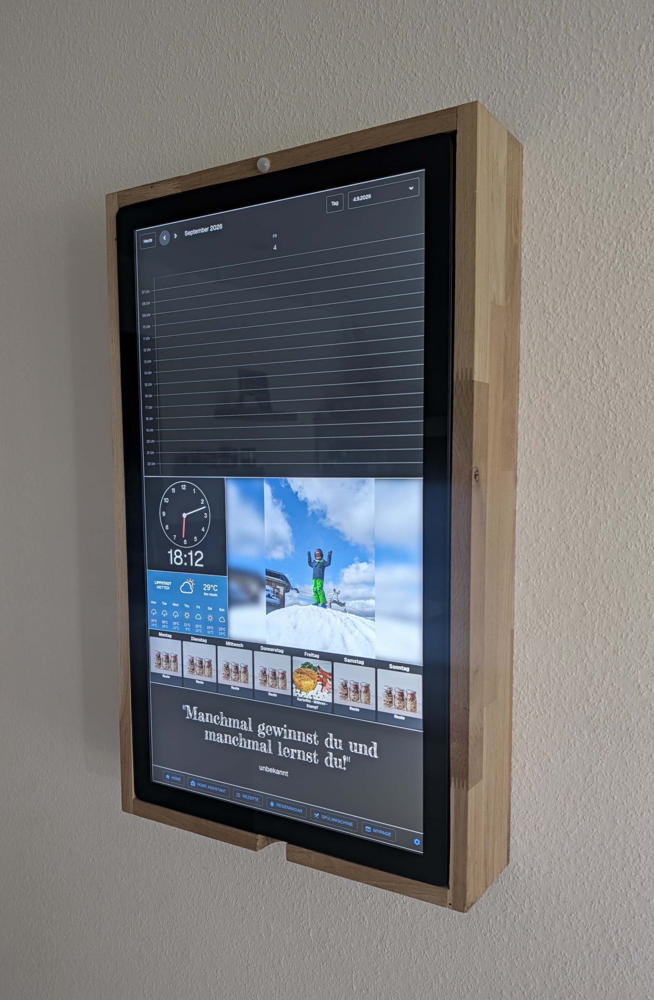
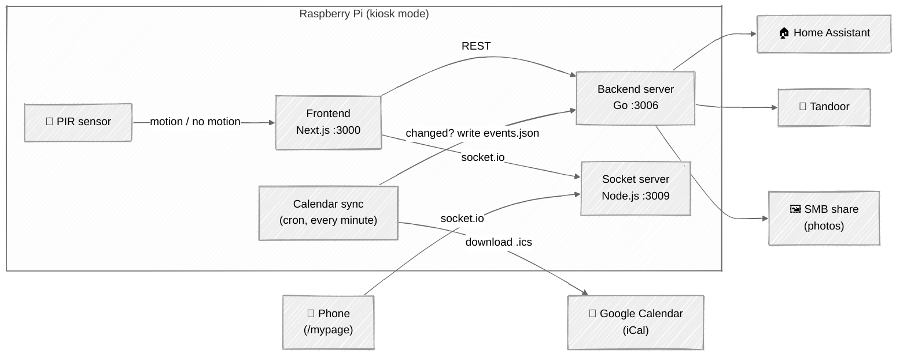

<div align="center">

# 🏠 Familyboard

**A self-hosted wall dashboard for your family, running on a Raspberry Pi.**

Calendars · Weather · Meal plan · Photo slideshow · Home Assistant · Household helpers

[](backend/server)
[](frontend)
[](backend/socketserver)
[](install.sh)




</div>

---

Familyboard turns a wall-mounted screen (typically a Raspberry Pi in kiosk
mode) into a shared family dashboard — everyone's calendars in one place,
today's weather, what's for dinner (via [Tandoor](https://tandoor.dev/)), a
rotating photo slideshow from an SMB share, Home Assistant status, and small
household helpers like a dishwasher turn-tracker. A PIR motion sensor
attached to the Pi turns the screen off to save power when nobody's in the
room, and back on automatically as soon as someone walks in.

## What's in this repo

| Path | What it is |
| --- | --- |
| [`frontend/`](frontend) | Next.js app that renders the board UI |
| [`backend/`](backend) | Go server(s) for calendar/event data, images, and config, plus a Node.js socket server and utility scripts (calendar sync, updater, PIR motion sensor, ...) |
| [`install.sh`](install.sh) + [`backend/installation_files/`](backend/installation_files) | systemd services and scripts to run Familyboard on a dedicated device that boots straight into the kiosk display |
| [`deliver2raspi.sh`](deliver2raspi.sh) | deploy script to push a local checkout to a running Familyboard Pi over SSH and rebuild/restart everything there |

## Architecture



The frontend polls the Go backend for calendar/event/recipe/photo data and
talks to the Node.js socket server for the "open this on the board" feature
driven from a phone on `/mypage`. The backend itself talks to Home
Assistant, Tandoor, and the SMB share directly.

Calendars are handled a bit differently: the browser can't fetch Google's
iCal feeds itself (Google doesn't send CORS headers for them), so a small Go
utility ([`buildEventsJson`](backend/utils/calendarEvents)) runs as a cron
job every minute on the Pi, downloads each configured `.ics` feed, hashes it
and compares it against the previously stored hash, and only rewrites
`events.json` when something actually changed. The frontend then just reads
the already-up-to-date `events.json` from the backend.

A PIR motion sensor wired to the Pi's GPIO ([`pir.py`](backend/utils/pir))
turns the kiosk screen off after 10 minutes without motion, and back on
immediately when motion is detected again, to save power when nobody's
around.

## Getting started: overall workflow

Setting up Familyboard on a dedicated Raspberry Pi display looks like this,
start to finish:

1. **Flash Raspberry Pi OS** onto the Pi (e.g. with Raspberry Pi Imager) and
   create a Linux user named `admin` during setup — the install/deploy
   scripts assume this user and expect the app to live at
   `/home/admin/familyboard`. Boot the Pi and make sure it's reachable, e.g.
   as `familyboard.local`. Then set up passwordless SSH and sudo for `admin`
   — see the prerequisites in
   [Deployment on a dedicated device](#deployment-on-a-dedicated-device) —
   since `install.sh` and `deliver2raspi.sh` run entirely over non-interactive
   SSH and can't prompt for either.
2. **Clone this repo on your development machine** — that's the only place
   it needs to be cloned. The Pi never runs `git clone`; the deploy script
   below rsyncs the code there instead.

   ```bash
   git clone <this-repo-url> familyboard
   ```

3. **Fill in your configuration on the development machine** — copy the
   backend and frontend config templates and fill in your own values. See
   [Backend configuration](#backend-configuration) and
   [Frontend configuration](#frontend-configuration) below. The backend
   config is split in two files so both environments can hold different
   values (e.g. different paths) without overwriting each other:
   `backend-config.local.yaml` for running locally on your dev machine, and
   `backend-config.raspi.yaml`, which `deliver2raspi.sh` pushes to the Pi.
   You only ever edit these on your development machine.
4. **Bootstrap the Pi**, run from your development machine:

   ```bash
   bash deliver2raspi.sh --bootstrap
   ```

   This rsyncs the repo to the Pi and then runs `install.sh` there over SSH
   to install dependencies, set up Samba, and install/enable the systemd
   services, logrotate config, and cron jobs — no manual login to the Pi
   required. This is a fresh install (`apt upgrade`, Node.js/Go downloads,
   npm installs), so it can easily take 15-30+ minutes depending on the Pi
   model and network speed — that's normal. See
   [Deployment on a dedicated device](#deployment-on-a-dedicated-device).
5. **From then on, deploy code (and config) changes with plain
   `deliver2raspi.sh`** (no `--bootstrap`), run from your development
   machine — it rsyncs the repo, including `backend-config.raspi.yaml`, to
   the Pi, rebuilds everything there, and restarts the services. See
   [Ongoing deployment](#ongoing-deployment).

For day-to-day coding without a Pi, see
[Running locally for development](#running-locally-for-development) instead.

## Setup

### Backend configuration

Familyboard reads its backend config from one YAML file, but which file
depends on where it's running:

- **`backend/backend-config.raspi.yaml`** — used on the Pi (both by
  `install.sh`'s first calendar-config build and by the systemd services,
  which set `FAMILYBOARD_CONFIG_FILE=backend-config.raspi.yaml`). Create and
  edit it on your development machine; `deliver2raspi.sh` pushes it to the
  Pi on every deploy.
- **`backend/backend-config.local.yaml`** — used when running the Go
  backend locally on your development machine (see
  [Running locally for development](#running-locally-for-development)
  below), where paths differ from the Pi's. Never pushed to the Pi.

Both are gitignored since they contain secrets (calendar tokens, Wi-Fi/SMB
passwords, API tokens). Create them from the template:

```bash
cp backend/backend-config_template.yaml backend/backend-config.raspi.yaml
cp backend/backend-config_template.yaml backend/backend-config.local.yaml
```

Edit both files and fill in, among others:

- `calendarsources` — your calendar iCal URLs (e.g. Google Calendar).
- `homeassistant` — IP, port, and user of your Home Assistant instance.
- `smbserver` — SMB share details for the photo slideshow.
- `tandoor` — IP, port, and bearer token for your Tandoor recipe instance.
- `weather` — your own `weatherwidget.io` and/or Windy embed codes for your
  location.
- `calendarspath`, `eventspath`, `logpath`, `mainpath` — absolute paths.
  The template already matches the `install.sh`/`deliver2raspi.sh` default
  layout (`/home/admin/familyboard`), which is correct for
  `backend-config.raspi.yaml` as-is. For `backend-config.local.yaml`, change
  these to the absolute path of your local checkout.

### Frontend configuration

Copy the example env file and fill in your own values:

```bash
cp frontend/.env.example frontend/.env.local
```

- `NEXT_PUBLIC_DISHWASHER_KIDS` — comma-separated list of the kids shown on
  the dishwasher turn-tracker page (`/spuelmaschine`).
- `NEXT_PUBLIC_FAMILYBOARD_HOST` — IP/hostname of the Familyboard device on
  your local network, used by the `/mypage` page (opened on a phone) to reach
  the board's socket server.

## Running locally for development

Familyboard consists of three separate processes that all need to run at the
same time. Open a terminal per process:

```bash
# 1. Frontend (Next.js dev server, http://localhost:3000)
cd frontend
npm install
npm run dev
```

```bash
# 2. Backend server (Go, serves calendar/event/config data and images on :3006)
cd backend/server
FAMILYBOARD_CONFIG_FILE=backend-config.local.yaml go run .
```

```bash
# 3. Socket server (Node.js, used by the /mypage page, on :3009)
cd backend/socketserver
npm install
node server.js
```

Make sure `backend/backend-config.local.yaml` and `frontend/.env.local`
exist and are filled in first (see "Backend configuration" and "Frontend
configuration" above) — the frontend and backend server both read from them
at startup. `FAMILYBOARD_CONFIG_FILE` defaults to `backend-config.yaml` if
unset, so don't forget to set it when running locally.

## Deployment on a dedicated device

`install.sh` and the systemd unit files in `backend/installation_files/`
assume the Familyboard app runs under a Linux user named `admin` in
`/home/admin/familyboard`. If you use a different user or install path,
update `LINUX_USER` in `install.sh` and the `WorkingDirectory`/`ExecStart`/
`User` entries in the `.service` files accordingly before installing them.

**Prerequisites on the Pi, before running `deliver2raspi.sh --bootstrap`:**
`install.sh` and `deliver2raspi.sh` run entirely over non-interactive SSH —
there's no TTY for either to prompt on — so `admin` needs both passwordless
SSH login and passwordless sudo set up on the Pi first, or `apt`/`systemctl`/
etc. calls will silently fail with `sudo: a password is required` partway
through:

- **Passwordless SSH**: either set an SSH public key for `admin` when
  flashing the SD card (Raspberry Pi Imager's ⚙️ "Edit Settings" dialog, or
  manually via `userconf.txt`/`ssh` on the boot partition — Raspberry Pi OS
  does *not* use cloud-init/`user-data`, that's an Ubuntu-only mechanism), or
  copy a key over after first boot with `ssh-copy-id admin@familyboard.local`.
- **Passwordless sudo**: SSH into the Pi once (`ssh admin@familyboard.local`,
  password login is fine for this one-off step) and run:

  ```bash
  echo "admin ALL=(ALL) NOPASSWD:ALL" | sudo tee /etc/sudoers.d/010_admin-nopasswd
  sudo chmod 440 /etc/sudoers.d/010_admin-nopasswd
  ```

Verify both from your development machine before bootstrapping:

```bash
ssh admin@familyboard.local "sudo -n true && echo OK"
```

Initial setup of a fresh Raspberry Pi — run from your development machine,
not on the Pi:

```bash
bash deliver2raspi.sh --bootstrap
```

Expect this to take 15-30+ minutes on a fresh Pi (`apt upgrade`, Node.js/Go
downloads, npm installs, frontend build) — that's normal, let it run.

This rsyncs the repo to the Pi, then runs `install.sh` there over SSH. (If
you ever need to run `install.sh` directly on the Pi instead — e.g. to debug
a failed bootstrap — it must run as the `admin` user from inside
`/home/admin/familyboard`, which `deliver2raspi.sh` has already populated by
that point.)

`install.sh` installs Node.js and Go, sets up Samba, installs/enables the
systemd services and logrotate config, sets up the required root crontab
entries (shutdown/reboot, wifi power-save, `checkNetwork.sh`, calendar
rebuild jobs — see the script for the exact schedule), and, if run
interactively, asks whether to rotate the display 90°. There are two
different mechanisms depending on the physical display, and the script asks
which one applies:

- **Official Raspberry Pi DSI touchscreen** — rotated via
  `lcd_rotate=1`/`display_rotate=1` in `/boot/firmware/config.txt`. A reboot
  is needed for it to take effect (the script offers to do this for you).
- **Regular HDMI monitor** — under Wayland/labwc, `config.txt` rotation
  doesn't apply to HDMI output. Instead the script writes a
  [kanshi](https://sr.ht/~emersion/kanshi/) output profile to
  `~/.config/kanshi/config` (`output <name> transform 90`), which the kanshi
  daemon already running in labwc's autostart picks up immediately — no
  reboot needed.

It only needs to run
once per Pi: it writes a marker file
(`/home/admin/.familyboard-installed`) on success and refuses to run again
after that, so re-running `deliver2raspi.sh --bootstrap` by accident on an
already-set-up Pi is harmless — it just skips `install.sh` and continues
with the normal deploy. For code/config updates, use plain `deliver2raspi.sh`
(without `--bootstrap`) instead — see
[Ongoing deployment](#ongoing-deployment). To force a full re-install
anyway, run `install.sh --force` directly on the Pi — it's safe to re-run
(every step is idempotent, including the crontab entries, which it manages
as a single replaceable block rather than duplicating), though it does
briefly restart Samba and the kiosk browser, so expect a short visible
reload on the display. A few steps genuinely can't be scripted and are
printed at the end of the script — see them there, or below:

1. If using a USB wifi dongle, disable the onboard wifi in
   `/boot/firmware/config.txt` (`dtoverlay=disable-wifi`).

2. In `raspi-config` → Advanced Options, select Wayland as the display
   server.

3. Make sure `backend/backend-config.raspi.yaml` exists and is filled in.
   It's not created by this script — create/edit it on your development
   machine (see "Backend configuration" above) and it will be copied here by
   `deliver2raspi.sh` on the next deploy.

## Ongoing deployment

Once the Pi is set up, push code changes from your development machine with:

```bash
bash deliver2raspi.sh
```

This rsyncs the repo to the Pi — including `backend-config.raspi.yaml`, but
excluding `backend-config.local.yaml` and local data files — rebuilds the Go
binaries and the frontend on the Pi, and restarts the systemd services.
Adjust `PI_USER`/`PI_HOST`/`PI_DIR` at the top of the script if they differ
from the defaults (`admin`, `familyboard.local`, `/home/admin/familyboard`).
It requires SSH key access to the Pi.
